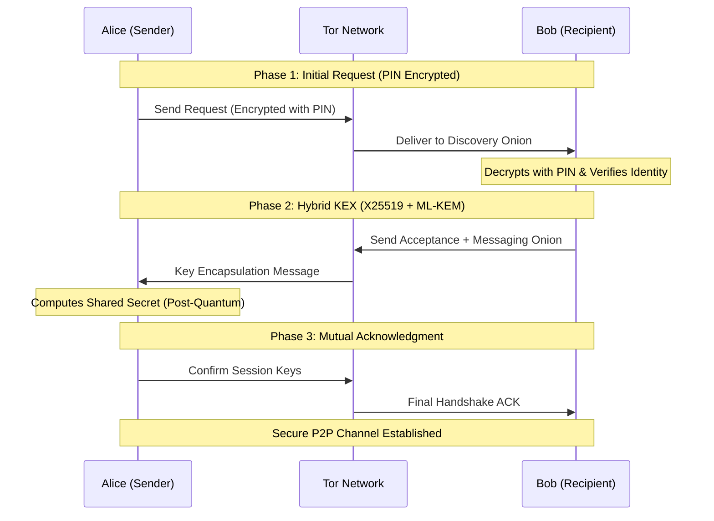
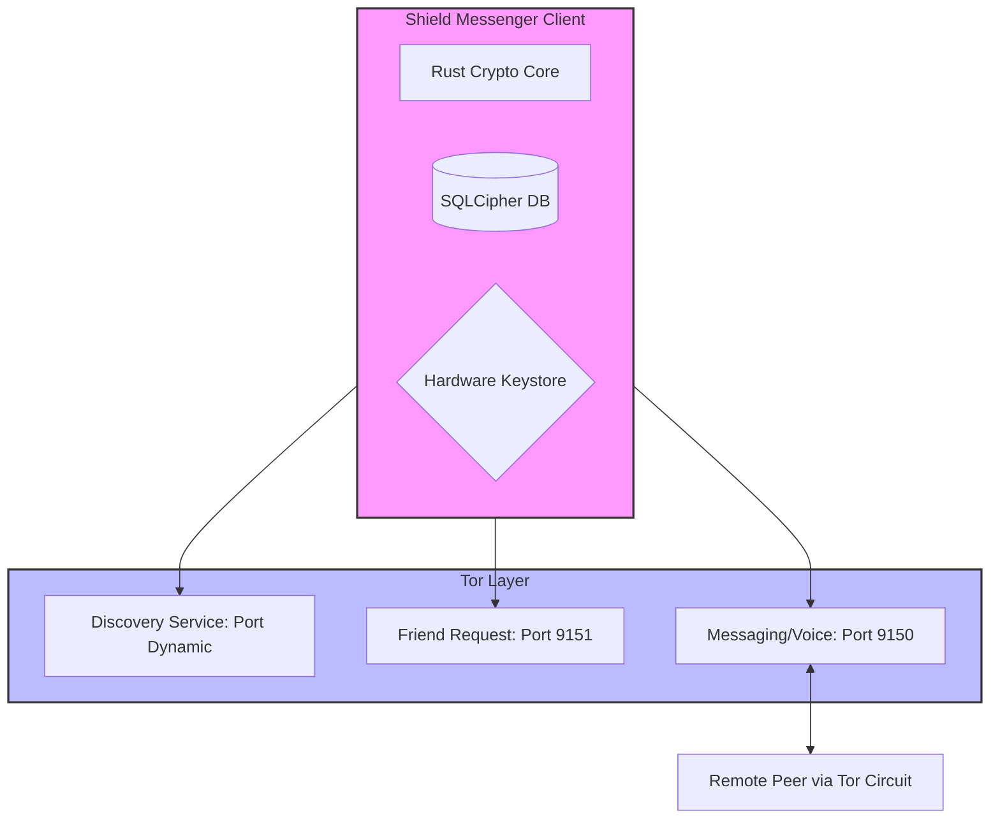

<div align="center">

# 🛡️ Shield Messenger

**The First Truly Serverless, Post-Quantum Encrypted Messenger with Integrated Private Payments**

<p align="center">
  
  
  
</p>

<p align="center">
  
  
  
  
  
  
  
</p>

> **No message servers. No metadata. No compromises.**
>
> **Clarification on "Serverless":** Shield Messenger is serverless in the messaging layer — all
> chat messages, voice calls, and file transfers flow directly between peers over Tor hidden
> services without passing through any central server. The project does include a lightweight
> Express/TypeScript server, but its role is strictly limited to the **public website** (landing
> page, blog CMS, billing dashboard, and admin panel). This server **never** touches, routes,
> stores, or has access to any user messages, keys, or metadata.

[Website](https://shieldmessenger.com) · [Whitepaper](docs/WHITEPAPER.md) · [Architecture](docs/ARCHITECTURE.md) · [Contributing](CONTRIBUTING.md) · [Security](SECURITY.md)

</div>

---

## What is Shield Messenger?

Shield Messenger is a **privacy-first, multi-platform communication system** that combines truly serverless peer-to-peer messaging, post-quantum cryptography, and integrated cryptocurrency payments. Unlike conventional encrypted messengers, Shield Messenger eliminates ALL central infrastructure from the messaging path — no servers exist to route, store, or log messages or metadata, and no company can hand over data that was never collected. A separate public-facing web server exists solely for the project website and billing; it has zero access to the messaging layer.

### Why Shield Messenger?

| Feature | Shield Messenger | Signal | Session | Briar | SimpleX |
|---------|:---:|:---:|:---:|:---:|:---:|
| **Serverless P2P** | ✅ Direct Tor | ❌ Central servers | ❌ SNODE relays | ⚠️ Limited | ❌ Relays |
| **Metadata Resistance** | ✅ Impossible to collect | ❌ Logged | ⚠️ Partial | ✅ Yes | ⚠️ Minimal |
| **Post-Quantum Crypto** | ✅ ML-KEM-1024 | ⚠️ PQXDH | ❌ | ❌ | ⚠️ Partial |
| **Offline Messaging** | ✅ Full queue system | ❌ Requires servers | ❌ Requires SNODEs | ⚠️ Limited | ❌ |
| **Integrated Wallet** | ✅ ZEC + SOL | ⚠️ MobileCoin | ❌ | ❌ | ❌ |
| **Hardware-Backed Keys** | ✅ StrongBox/TEE | ❌ Software | ❌ Software | ❌ Software | ❌ Software |
| **System-Wide Tor VPN** | ✅ All apps | ❌ | ❌ | ❌ | ❌ |
| **Voice Calls Over Tor** | ✅ Opus codec | ✅ VoIP | ❌ | ❌ | ❌ |
| **Multi-Platform** | ✅ Android/Web/iOS | ✅ | ⚠️ | ⚠️ | ✅ |

---

## Architecture

```
┌─────────────────────────────────────────────────────────────────┐
│                   Shield Messenger Platform                      │
├───────────────┬──────────────┬──────────────┬───────────────────┤
│   Android     │     iOS      │     Web      │    Server (API)   │
│   Kotlin      │  Swift/UI    │  React/TS    │  Express/TS       │
│   Material 3  │  SwiftUI     │  Tailwind    │  SQLite + JWT     │
├───────────────┴──────────────┴──────────────┴───────────────────┤
│                Platform Bindings (FFI Layer)                     │
│   JNI (Android) │ C FFI (iOS) │ WASM (Web) │ REST API (Server) │
├─────────────────────────────────────────────────────────────────┤
│                    Rust Core Library                             │
│  ┌───────────┬───────────┬───────────┬─────────────────────┐   │
│  │  Crypto   │  Network  │  Storage  │   Protocol          │   │
│  │ XChaCha20 │ Tor HS    │ SQLCipher │   Messages          │   │
│  │ Ed25519   │ PingPong  │ KV Store  │   Presence          │   │
│  │ X25519    │ SOCKS5    │ Files     │   Calls             │   │
│  │ ML-KEM    │ Arti      │ Backup    │   Payments          │   │
│  │ PQ Ratchet│ Packets   │ Shamir    │                     │   │
│  │ Argon2    │ P2P       │ DeadMan   │                     │   │
│  └───────────┴───────────┴───────────┴─────────────────────┘   │
├─────────────────────────────────────────────────────────────────┤
│          Shield Messenger Protocol (P2P over Tor)               │
│   Triple .onion Architecture │ Ping-Pong Wake │ Direct P2P      │
├─────────────────────────────────────────────────────────────────┤
│          External Services (Payments Only)                      │
│   Zcash (ZEC Shielded) │ Solana (SOL / USDC / USDT)            │
└─────────────────────────────────────────────────────────────────┘
```

### Technology Stack

| Layer | Technology | Purpose |
|-------|-----------|---------|
| **Rust Core** | Rust 1.70+ | Cryptography, Tor, protocol, payments |
| **Android** | Kotlin + JNI | Native Android app (153 files, Material 3) |
| **Web** | React 19 + TypeScript + Vite 6 | Browser application with 17-language i18n |
| **iOS** | Swift + SwiftUI + C FFI | iOS application (16 languages) |
| **Server** | Express 4 + TypeScript + SQLite | Public website API, CMS, billing, admin (**not** involved in messaging) |
| **Deployment** | Nginx + PM2 + Let's Encrypt | Production hosting |

---

## Cryptographic Primitives

| Component | Algorithm | Key Size | Purpose |
|-----------|-----------|----------|---------|
| **Post-Quantum KEM** | Hybrid X25519 + ML-KEM-1024 | 64-byte combined | NIST FIPS 203 quantum-resistant key exchange |
| **Message Encryption** | XChaCha20-Poly1305 | 256-bit | AEAD authenticated encryption |
| **Digital Signatures** | Ed25519 | 256-bit | Message authentication & sender verification |
| **Key Exchange** | X25519 ECDH | 256-bit | Classical ephemeral session keys |
| **Key Derivation** | HKDF-SHA256 | 256-bit | Per-message key ratcheting |
| **Forward Secrecy** | HMAC-based ratchet | 256-bit | Bidirectional key chains |
| **Voice Encryption** | XChaCha20-Poly1305 | 256-bit | Real-time audio stream encryption |
| **Password Hashing** | Argon2id | Variable | Memory-hard PIN/password derivation |
| **Database** | AES-256-GCM (SQLCipher) | 256-bit | Local storage encryption |
| **Server Fields** | AES-256-GCM | 256-bit | Email field encryption at rest |

---

## Shield Messenger Protocol

### Ping-Pong Wake Protocol

```
SENDER                                RECIPIENT
  │                                       │
  ├── Create encrypted message            │
  ├── Store in local queue                │
  ├── Send PING ─────────────────────────►│
  │   (via Tor hidden service)            ├── Receive wake notification
  │                                       ├── Authenticate (biometric)
  │◄────────────────────── PONG ──────────┤
  │   (confirmed online + authed)         │
  ├── Send encrypted message ────────────►│
  │   (via Tor)                           ├── Decrypt & display
  │◄────────────────────── ACK ───────────┤
  ├── Delete from queue                   │
```

### Triple .onion Architecture

Three separate Tor hidden services per user for defense-in-depth:

1. **Friend Discovery** — Shareable via QR code for contact exchange
2. **Friend Request** (port 9151) — Receives PIN-encrypted friend requests
3. **Messaging** (port 9150) — Receives end-to-end encrypted messages

### Three-Phase Friend Request

1. **Phase 1** — PIN-encrypted initial request (XSalsa20-Poly1305)
2. **Phase 2** — Post-quantum hybrid acceptance (X25519 + ML-KEM-1024)
3. **Phase 3** — Mutual acknowledgment with full contact card exchange



### Network Architecture



---

## Secure Pay

Built-in multi-chain cryptocurrency wallet with in-chat payment protocol:

- **Zcash (ZEC)** — Privacy-focused shielded transactions (z-addresses)
- **Solana (SOL)** — Fast, low-fee payments
- **SPL Tokens** — USDC and USDT stablecoin support
- **In-Chat Quotes** — Send payment requests directly in conversations
- **One-Tap Payments** — Recipient accepts with a single tap
- **Cryptographic Verification** — Transaction signatures prevent double-spend

---

## Project Structure

```
shield-messenger/
├── app/                          # Android app (Kotlin — 153 files)
│   ├── src/main/java/com/shieldmessenger/
│   │   ├── crypto/               # RustBridge (JNI), KeyManager, TorManager
│   │   ├── services/             # TorService, MessageService, Wallet services
│   │   ├── database/             # Room DB + SQLCipher + DAOs
│   │   └── ...                   # 49 Activities, Material 3 UI
│   └── src/main/jniLibs/        # Compiled Rust .so libraries
│
├── shield-messenger-core/           # Rust shared core library
│   ├── src/
│   │   ├── crypto/               # XChaCha20, Ed25519, X25519, ML-KEM
│   │   ├── network/              # Tor, Ping-Pong, SOCKS5
│   │   ├── protocol/             # Message serialization
│   │   ├── securepay/            # Payment protocol
│   │   └── ffi/                  # JNI + C FFI + WASM bindings
│   └── Cargo.toml
│
├── web/                          # Web app (React 19 + TypeScript)
│   ├── src/
│   │   ├── components/           # React components + Sidebar
│   │   ├── pages/                # Landing, Chat, Contacts, Wallet, Security
│   │   ├── lib/                  # Stores (Zustand), protocol client, i18n
│   │   └── styles/               # Tailwind CSS
│   ├── tests/                    # 175 tests (Vitest)
│   └── vite.config.ts
│
├── ios/                          # iOS app (Swift + SwiftUI)
│   └── ShieldMessenger/Sources/
│       ├── Core/                 # Rust C FFI bridge
│       ├── Views/                # SwiftUI views (16 languages)
│       ├── Models/               # Data models
│       └── Services/             # Background services
│
├── server/                       # API Gateway (Express + TypeScript)
│   ├── src/
│   │   ├── routes/               # CMS, billing, support, admin, discovery, analytics
│   │   ├── middleware/           # JWT auth + admin role + audit logging
│   │   ├── db/                   # SQLite migrations (14 tables)
│   │   └── utils/                # AES-256-GCM encryption, HMAC, validation
│   ├── tests/                    # 131 tests (Vitest)
│   └── Dockerfile
│
├── shared/                       # Shared protocol definitions
│   ├── proto/                    # Protocol buffer definitions
│   └── types/                    # Cross-platform type definitions
│
├── docs/                         # Documentation
│   ├── WHITEPAPER.md            # Technical whitepaper
│   ├── ARCHITECTURE.md          # System architecture
│   └── VISION.md                # Vision & mission
│
├── deploy/                       # Deployment configs (templates)
├── docker-compose.yml            # Docker containerization
└── CHANGELOG.md                  # Detailed version history
```

---

## Quick Start

### Prerequisites

| Tool | Version | Purpose |
|------|---------|---------|
| **Rust** | 1.70+ | Core crypto library |
| **Android Studio** | Hedgehog+ | Android development |
| **Node.js** | 20+ | Web app & server |
| **Android NDK** | 26.1+ | Cross-compilation |
| **cargo-ndk** | Latest | Android Rust builds |

### Build Android

```bash
# Clone the repository
git clone https://github.com/abokenan444/shield-messenger.git
cd shield-messenger

# Build Rust core for Android
cd shield-messenger-core
rustup target add aarch64-linux-android armv7-linux-androideabi x86_64-linux-android
cargo install cargo-ndk
./build_android.sh

# Open in Android Studio → Run
```

### Build Web App

```bash
cd web
npm install
npm run dev        # Development server (port 3000)
npm run build      # Production build
npm test           # Run 175 tests
```

### Build Server

```bash
cd server
npm install
cp .env.example .env   # Configure your environment variables
npm run dev            # Development server (port 4000)
npm test               # Run 131 tests
```

### Environment Variables

Copy `.env.example` and configure:

```env
PORT=4000
NODE_ENV=production
JWT_SECRET=<generate with: node -e "console.log(require('crypto').randomBytes(32).toString('hex'))">
FIELD_ENCRYPTION_KEY=<generate with: node -e "console.log(require('crypto').randomBytes(32).toString('hex'))">
SQLITE_PATH=./data/shield_messenger.db
CORS_ORIGIN=https://yourdomain.com
```

---

## Testing

| Suite | Tests | Framework |
|-------|-------|-----------|
| **Server** | 131 | Vitest + Supertest |
| **Web** | 175 | Vitest + React Testing Library |
| **Total** | **306** | All passing |

```bash
# Run all server tests
cd server && npm test

# Run all web tests
cd web && npm test

# Run specific test file
npx vitest run tests/crypto.test.ts
```

---

## Internationalization

Shield Messenger supports **17 languages** across all platforms:

| Language | Web | iOS | Server |
|----------|:---:|:---:|:---:|
| English | ✅ | ✅ | ✅ |
| Arabic (العربية) | ✅ | ✅ | ✅ |
| Spanish (Español) | ✅ | ✅ | ✅ |
| French (Français) | ✅ | ✅ | ✅ |
| German (Deutsch) | ✅ | ✅ | ✅ |
| Chinese (中文) | ✅ | ✅ | ✅ |
| Japanese (日本語) | ✅ | ✅ | ✅ |
| Korean (한국어) | ✅ | ✅ | ✅ |
| Russian (Русский) | ✅ | ✅ | ✅ |
| Portuguese (Português) | ✅ | ✅ | ✅ |
| Turkish (Türkçe) | ✅ | ✅ | ✅ |
| Hindi (हिन्दी) | ✅ | ✅ | ✅ |
| Indonesian | ✅ | ✅ | ✅ |
| Italian (Italiano) | ✅ | ✅ | ✅ |
| Persian (فارسی) | ✅ | ✅ | ✅ |
| Dutch (Nederlands) | ✅ | ✅ | ✅ |
| Urdu (اردو) | ✅ | ✅ | ✅ |

---

## Threat Model

### Protected Against

- ✅ Passive network surveillance (Tor + onion routing)
- ✅ Active MITM attacks (Ed25519 signatures + Tor E2E)
- ✅ Server compromise (no servers to compromise)
- ✅ Metadata analysis (no centralized logs)
- ✅ Device seizure (duress PIN → instant cryptographic wipe)
- ✅ Traffic correlation (Tor + triple .onion)
- ✅ Future quantum attacks (ML-KEM-1024)
- ✅ Key extraction (hardware-backed StrongBox/TEE)

### Not Protected Against

- ❌ Hardware supply chain attacks (compromised device)
- ❌ Endpoint malware (keyloggers, screen capture)
- ❌ Social engineering (phishing, impersonation)
- ❌ Physical coercion (duress PIN provides limited defense)

---

## Roadmap

### Completed

- [x] Rust cryptography core (XChaCha20, Ed25519, X25519, ML-KEM)
- [x] Android app with 153 Kotlin files, Material 3
- [x] Post-quantum hybrid encryption (X25519 + ML-KEM-1024)
- [x] Triple .onion Tor architecture
- [x] Ping-Pong wake protocol
- [x] Secure Pay (Zcash + Solana + SPL tokens)
- [x] Voice calling over Tor (Opus codec)
- [x] Tor VPN mode (system-wide OnionMasq)
- [x] Per-message forward secrecy
- [x] Web app (React 19) with WebRTC
- [x] iOS app (SwiftUI) with C FFI bridge
- [x] Server API (Express + admin panel)
- [x] 17-language internationalization
- [x] 306 automated tests
- [x] Production deployment with SSL

### In Development

- [x] Post-quantum Double Ratchet (ML-KEM-1024 ratchet every 50 messages)
- [x] Fixed-size packet layer (8192-byte traffic analysis resistance)
- [x] Pure-Rust Tor integration (Arti client)
- [x] Encrypted backup with Shamir's Secret Sharing social recovery
- [x] Dead Man's Switch for automatic key destruction
- [x] Reproducible builds (multi-stage Docker + CI verification)
- [x] Fuzz testing targets (cargo-fuzz)
- [ ] File attachments (documents, videos)
- [ ] Group messaging (multi-party E2EE)
- [ ] F-Droid & Play Store release

### Planned

- [ ] Desktop client (Tauri + Rust)
- [x] Contact verification safety numbers (QR-based fingerprint scan)
- [ ] Mesh networking (WiFi Direct)
- [ ] Monero (XMR) integration
- [ ] Lightning Network payments

---

## Contributing

We welcome contributions! See [CONTRIBUTING.md](CONTRIBUTING.md) for guidelines.

### Areas to Contribute

- **Security** — Code review, threat modeling, penetration testing
- **Development** — Bug fixes, features, performance optimization
- **Documentation** — Technical docs, user guides, translations
- **Design** — UI/UX improvements, icons, branding
- **Testing** — Automated tests, device testing, bug reports

---

## Security Policy

**Found a vulnerability?** Do **NOT** open a public issue.

Email **security@shieldmessenger.com** with:
- Description of the vulnerability
- Steps to reproduce
- Potential impact assessment

We respond within 48 hours. See [SECURITY.md](SECURITY.md) for full policy.

---

## Beta Notice

This software is in **beta** and not production-ready for life-critical use.

- Security audit pending (planned Q2 2026)
- No reproducible builds yet
- Breaking changes may occur
- Use testnet for Secure Pay testing

---

## License

**PolyForm Noncommercial License 1.0.0**

- ✅ Personal use, education, research
- ✅ Modify and create derivative works
- ✅ Distribute (noncommercial only)
- ❌ Commercial use requires separate license

See [LICENSE](LICENSE) for full terms.

**Commercial licensing:** contact@shieldmessenger.com

---

## Acknowledgments

Built upon these open-source projects:

| Project | Use |
|---------|-----|
| [RustCrypto](https://github.com/RustCrypto) | ChaCha20-Poly1305, AEAD |
| [Dalek Cryptography](https://github.com/dalek-cryptography) | Ed25519, X25519 |
| [pqc_kyber](https://github.com/Argyle-Software/kyber) | ML-KEM-1024 (FIPS 203) |
| [Tor Project](https://www.torproject.org/) | Anonymous network |
| [Guardian Project](https://guardianproject.info/) | tor-android, OnionMasq |
| [Zcash](https://z.cash/) | Shielded transactions |
| [Solana](https://solana.com/) | Fast payments |
| [Opus Codec](https://opus-codec.org/) | Voice call audio |

---

<div align="center">

**Built with privacy as the foundation. Powered by post-quantum cryptography.**

**No servers. No metadata. No compromises.**

[Website](https://shieldmessenger.com) · [Whitepaper](docs/WHITEPAPER.md) · [GitHub](https://github.com/abokenan444/shield-messenger)

Copyright &copy; 2025-2026 Shield Messenger

</div>
