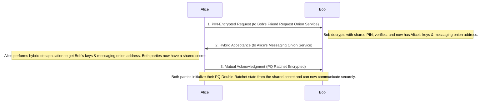

# Shield Messenger Protocol Specification

**Version:** 2.0
**Date:** 2026-02-26
**Status:** Technical Reference

---

## 1. Overview

This document provides a detailed technical specification of the Shield Messenger protocol. It is intended for security auditors, contributors, and anyone interested in the cryptographic and architectural design of the system.

Shield Messenger is a decentralized, peer-to-peer, end-to-end encrypted messaging system designed for maximum privacy and security. It operates entirely over the Tor network, with no central servers, ensuring zero metadata leakage and strong resistance to surveillance and censorship.

### 1.1. Core Design Principles

- **Decentralization:** No central servers are used for message relay, contact storage, or identity management. All communication is strictly peer-to-peer.
- **Anonymity:** All traffic is routed through Tor v3 hidden services, masking user IP addresses and locations.
- **Post-Quantum Security:** A hybrid key exchange (X25519 + ML-KEM-1024) and a Post-Quantum Double Ratchet provide forward and post-compromise secrecy, protecting against both current and future quantum threats.
- **Metadata Resistance:** Fixed-size packets, constant-rate cover traffic, and traffic shaping profiles are employed to thwart traffic analysis.
- **Plausible Deniability:** A Duress PIN feature allows a user under coercion to unlock a decoy profile while silently wiping all sensitive data.

---

## 2. Hidden Service Architecture

Shield Messenger employs a **dual Tor instance** architecture, with each instance managing a distinct hidden service. This isolates low-latency voice traffic from the main messaging traffic, optimizing performance and security.

```mermaid
graph TD
    subgraph User Device
        subgraph Main Tor Instance (SOCKS: 9050)
            A[Messaging Hidden Service] --> B[Port 9150: Handshake/Text/Files]
            A --> C[Port 9151: Reserved]
            A --> D[Port 9153: ACKs]
        end
        subgraph Voice Tor Instance (SOCKS: 9052)
            E[Ephemeral Voice Hidden Service] --> F[Port 9152: Voice/Video Stream]
        end
        G[Shield Messenger Core] <--> A
        G <--> E
    end
```

### 2.1. Service Creation

Hidden services are created dynamically using the `ADD_ONION` command sent to the Tor daemon's control port. The application uses `ED25519-V3` keys, which are the standard for v3 onion services.

- **Messaging Service:** A long-lived service whose address is shared with contacts. It exposes multiple virtual ports that map to local listeners managed by the Rust core.
- **Voice Service:** An ephemeral service created for the duration of a single call. Its address is exchanged over the existing encrypted channel (Messaging Service) before the call begins. This prevents linking call activity to a user's primary identity.

### 2.2. Port Mapping

The protocol uses a standardized set of ports for different functions:

| Virtual Port | Service | Local Target | Purpose |
| :--- | :--- | :--- | :--- |
| **9150** | Messaging | 8080 | Main channel for PING/PONG, handshake, text, files, and friend requests. |
| **9151** | Messaging | 9151 | Reserved for future use (e.g., TAP messages). |
| **9153** | Messaging | 9153 | Dedicated listener for delivery confirmations (ACKs) to optimize flow control. |
| **9152** | Voice | 9152 | Low-latency, high-throughput channel for encrypted voice/video streams. |

---

## 3. Handshake & PQ Double Ratchet

The protocol establishes a secure, post-quantum channel using a hybrid key agreement followed by a custom Post-Quantum Double Ratchet for ongoing communication.

### 3.1. Initial Handshake (Friend Request)

The handshake is a three-phase process initiated by one peer (Alice) and confirmed by the other (Bob).



### 3.2. Key Derivation Function (KDF) Chain

All keys are derived using a hierarchical KDF structure based on **HKDF-SHA256** and **HMAC-SHA256**. This ensures that keys used for different purposes are cryptographically separate.

1.  **Hybrid Shared Secret:** The initial key exchange combines X25519 and ML-KEM-1024 shared secrets:
    `HybridSecret = BLAKE3-KDF("ShieldMessenger-HybridKEM...", x25519_ss || mlkem_ss)`

2.  **Root Key:** A root key is derived from the hybrid secret:
    `RootKey = HKDF(salt=NULL, ikm=HybridSecret, info="ShieldMessenger-RootKey-v1")`

3.  **Chain Keys:** The root key is split into two initial chain keys, one for each direction of communication (determined by lexicographical comparison of onion addresses):
    `SendChainKey = HMAC(RootKey, 0x03)`
    `RecvChainKey = HMAC(RootKey, 0x04)`

4.  **Message Keys:** Each chain key is evolved to produce a per-message key. This provides forward secrecy.
    `MessageKey = HMAC(ChainKey, 0x02)`
    `NextChainKey = HMAC(ChainKey, 0x01)`

### 3.3. Post-Quantum Double Ratchet

The protocol uses a Double Ratchet algorithm enhanced with a periodic post-quantum rekeying step.

- **Symmetric-key Ratchet:** With every message sent or received, the corresponding chain key is evolved using `HMAC(chain_key, 0x01)`. This provides per-message forward secrecy.
- **DH Ratchet (X25519):** When the direction of communication changes, a Diffie-Hellman exchange is performed with new ephemeral keys. The output is used to derive a new Root Key, which in turn creates new chain keys. This provides self-healing from a state compromise.
- **KEM Ratchet (ML-KEM-1024):** Periodically (e.g., every 50 messages), the sender encapsulates a new ML-KEM shared secret to the receiver's public KEM key. This secret is mixed into the Root Key, providing post-compromise security even if the X25519 private keys are stolen.

Out-of-order messages are handled by caching up to 256 skipped message keys, allowing for robust delivery over Tor's high-latency network.

---

## 4. Padding Strategy & Traffic Patterns

To resist traffic analysis, the protocol implements a multi-layered padding and traffic shaping strategy.

- **Fixed-Size Packets:** All data is transported in fixed-size packets (runtime configurable to 4096, 8192, or 16384 bytes). The payload is padded with random bytes to conceal its true length.
- **Cover Traffic:** During idle periods, the client sends constant-rate cover traffic. These packets are indistinguishable from real message packets to an external observer, masking patterns of activity and inactivity.
- **Burst Padding:** To conceal the start and end of a message burst (e.g., when a user is typing), the client sends a configurable number of cover packets immediately before and after the real messages. This makes it difficult to correlate traffic bursts with user activity.
- **Traffic Shaping Profiles:** The padding strategy can be adapted based on the type of communication:
    - **Chat:** Optimized for low-latency, bursty text messages.
    - **File Transfer:** Optimized for high-throughput, sustained data streams.
    - **Voice/Video:** Optimized for constant-bitrate, low-latency media streams.

---

## 5. DoS Protection Mechanisms

Each client's hidden service is protected by a five-layer, application-level defense system to mitigate denial-of-service attacks.

1.  **Connection Rate Limiting:** A global limit on new connections per second and a stricter per-circuit limit on connections per minute prevent rapid-fire connection spam.
2.  **Concurrent Connection Cap:** A hard limit on the total number of simultaneous open connections prevents resource exhaustion.
3.  **Proof-of-Work (PoW) Challenge:** When connection load exceeds a configurable threshold (e.g., 75% of capacity), the service stops accepting connections directly. Instead, it issues a cryptographic PoW challenge (based on a hash function with a variable difficulty) that new clients must solve before being allowed to connect. This raises the cost for an attacker to establish connections.
4.  **Circuit-Level Throttling:** While not an explicit mechanism, the per-circuit rate limits effectively throttle the speed at which any single malicious Tor circuit can attack the service.
5.  **Automatic Blacklisting:** Circuits that repeatedly violate rate limits or fail PoW challenges are automatically added to a temporary blacklist, and all further connections from them are dropped for a configurable duration (e.g., 5 minutes).

---

## 6. Plausible Deniability / Duress PIN

The Duress PIN feature provides plausible deniability for users under physical coercion.

### 6.1. Mechanism

A user can configure a secondary PIN (the Duress PIN) in addition to their primary PIN. When the Duress PIN is entered at the lock screen:

1.  The application appears to unlock normally, but it loads a **decoy profile** (e.g., an empty contact list, no messages, default username).
2.  In the background, a silent, irreversible **wipe process** is initiated.

### 6.2. Wipe Actions

The wipe process is configurable but typically includes:
- **Cryptographic Erasure:** All cryptographic keys (identity, ratchet states, session keys) are securely zeroized and destroyed.
- **Data Deletion:** All contacts, messages, and call history are deleted from the local database.
- **Secure Overwrite:** The underlying storage space is overwritten with random data to prevent forensic recovery.

### 6.3. Security Properties

- **Indistinguishability:** The Duress PIN hash is stored using the same Argon2id hashing parameters as the primary PIN. An attacker examining the device's storage cannot tell if a Duress PIN is configured or distinguish its hash from the real one.
- **Silent Operation:** The wipe process is silent and provides no feedback to the user (or coercer). The app simply appears to be a fresh, unused installation.
- **Self-Destruction:** The duress configuration itself can be wiped, removing all evidence that the feature was ever enabled.
